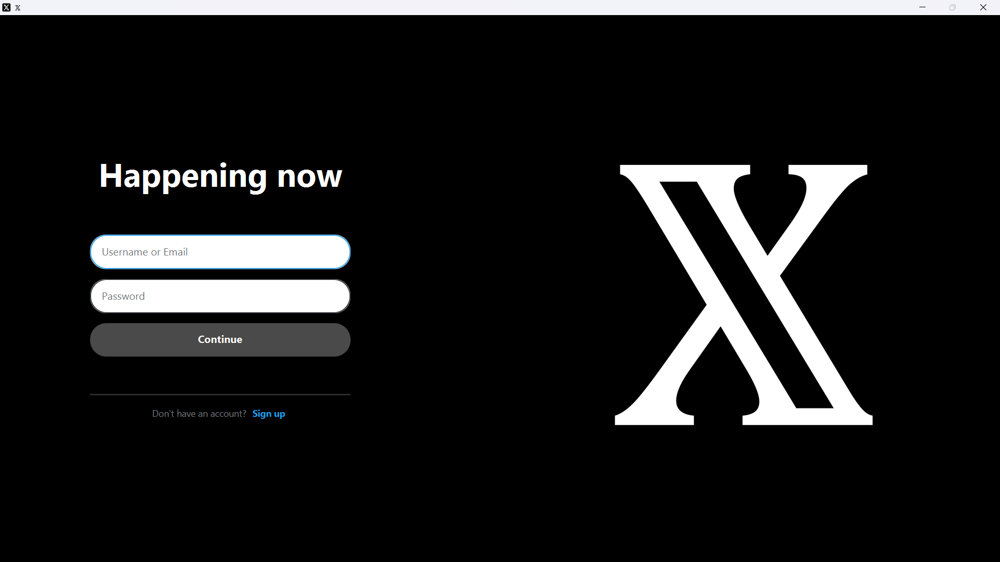
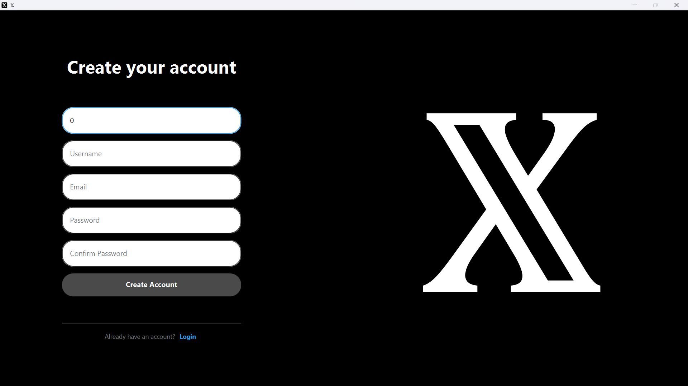
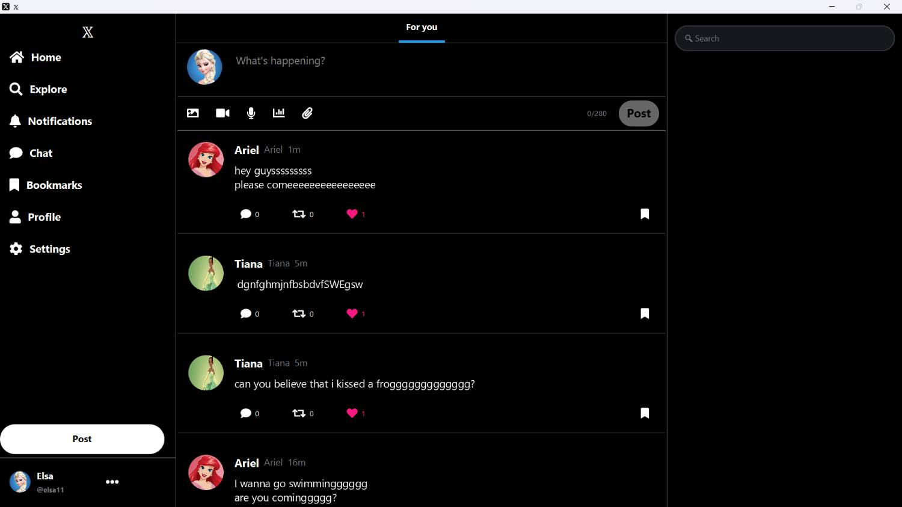
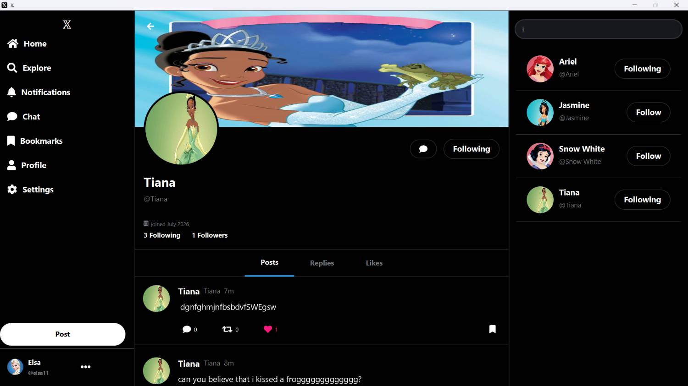
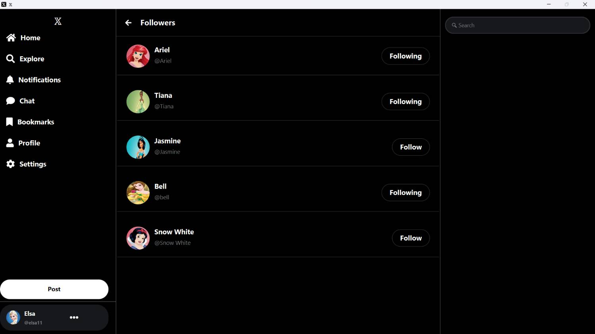
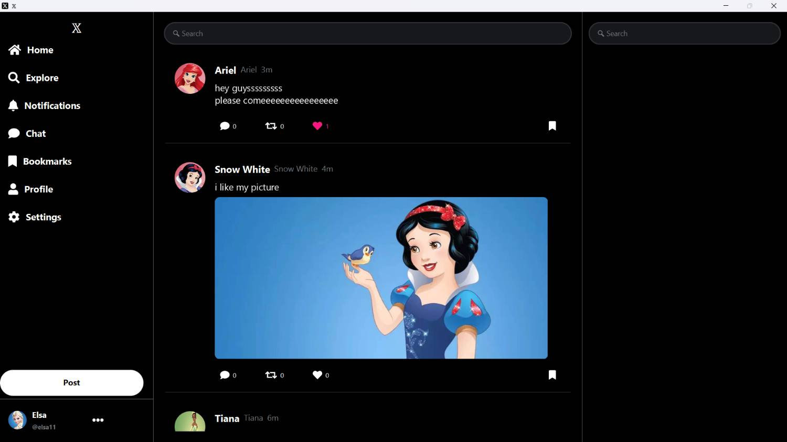
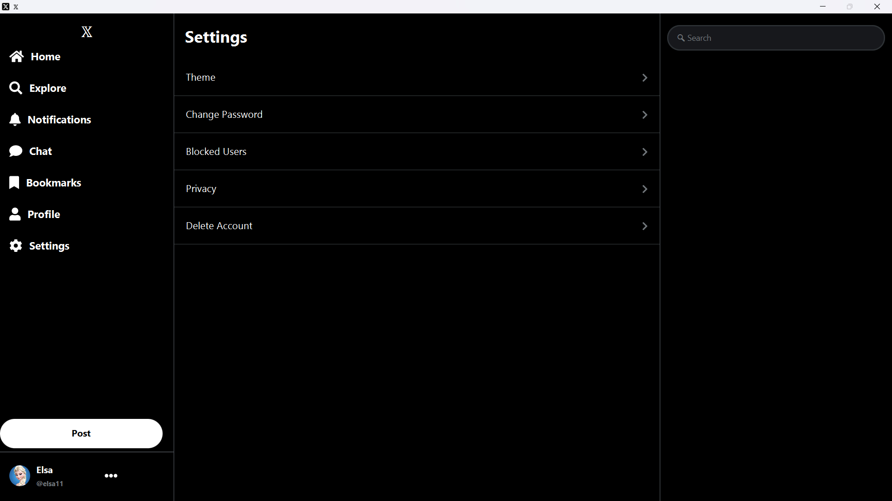

# 🐦 X-Clone

> **Advanced Programming Course Project**

X-Clone is a desktop social media application inspired by **X (Twitter)**. The project was developed using **Java**, **JavaFX**, **PostgreSQL**, and a **Client–Server architecture**. It focuses on implementing the core features of a social networking platform while applying object-oriented programming, database design, networking, and GUI development.

---

# 📑 Table of Contents

- [Project Description](#-project-description)
- [Objectives](#-objectives)
- [Technology Stack](#-technology-stack)
- [Main Features](#-main-features)
- [System Architecture](#-system-architecture)
- [Project Structure](#-project-structure)
- [Database](#-database)
- [Installation](#-installation)
- [Usage](#-usage)
- [Screenshots](#-screenshots)
- [Future Improvements](#-future-improvements)
- [Credits](#-credits)

---

# 📖 Project Description

The purpose of this project is to build a desktop social media platform where users can communicate by creating posts and following other users.

The application follows a layered Client–Server architecture. The client provides the graphical user interface, while the server processes requests and communicates with the PostgreSQL database. Shared models and DTOs are used for data exchange between both sides.

Throughout the project, emphasis was placed on clean code organization, modularity, and separation of responsibilities.

---

# 🎯 Objectives

- Practice Object-Oriented Programming
- Design a Client–Server application
- Work with PostgreSQL databases
- Build desktop interfaces using JavaFX
- Implement secure authentication
- Learn collaborative development using Git

---

# 🛠 Technology Stack

| Layer | Technology |
|------|------------|
| Language | Java |
| GUI | JavaFX |
| Build Tool | Maven |
| Database | PostgreSQL |
| Database Access | JDBC |
| Security | BCrypt |
| Version Control | Git & GitHub |

---

# ✨ Main Features

## Authentication

- Register new users
- Login
- Password hashing using BCrypt
- Change password
- Delete account

## Profile

- View profile
- Edit profile
- Update profile image
- Update banner image
- View posts, replies, likes

## Social Features

- Follow users
- Unfollow users
- Followers list
- Following list
- Home feed

## Posts

- Create posts
- Edit posts
- Delete posts
- Reply to posts
- Bookmark posts
- Retweet posts
- Like posts

## Search & Explore

- Search users
- Explore page

---

# 🏗 System Architecture

```
JavaFX Client
      │
      │ Request / Response
      ▼
Application Server
      │
      ▼
DAO Layer
      │
      ▼
PostgreSQL Database
```

The client sends requests to the server using DTO objects. The server validates each request, performs the required database operations through DAO classes, and returns an appropriate response.

---

# 📂 Project Structure

```text
X-clone
│
├── Client
│   ├── Controllers
│   ├── Managers
│   |── Utils
│
│
├── Server
│   ├── Database
│   
│   
│
├── Shared
│   ├── DTO
│   │     ├── enums
│   │     ├── request
│   │     ├── response
│   │
│   ├── Models
│   
│
├── database
├── resources
│       ├── css
│       ├── images
│       ├── fxml
├── pom.xml
└── README.md
```

---

# 🗄 Database

The application uses PostgreSQL.

Tables:

- Users
- Tweets
- Likes
- Bookmarks
- Follows
- Media
- Hashtags
- Tweet hashtags


Relationships between tables are maintained using foreign keys.

---

# 🚀 Installation

1. Clone the repository.

```bash
git clone https://github.com/F4temeAzizi/X-clone.git
```

2. Create a PostgreSQL database.

3. Copy `database.properties.example` to `database.properties`.

4. Configure database credentials.

5. Execute SQL scripts from the database folder.

6. Start the server.

7. Launch the client (XApplication).

---

# 💻 Usage

1. Register a new account.
2. Login.
3. Complete your profile.
4. Create your first post.
5. Follow other users.
6. Browse your personalized feed.
7. Like, reply to or bookmark posts.

---

# 📸 Screenshots


<table>
  <tr>
    <td align="center">
      <b>Login</b><br><br>
      
    </td>
    <td width="25"></td>
    <td align="center">
      <b>Sign Up</b><br><br>
      
    </td>
  </tr>

  <tr>
    <td colspan="3"><br></td>
  </tr>

  <tr>
    <td align="center">
      <b>Home Feed</b><br><br>
      
    </td>
    <td width="25"></td>
    <td align="center">
      <b>Profile</b><br><br>
      
    </td>
  </tr>

  <tr>
    <td colspan="3"><br></td>
  </tr>

  <tr>
    <td align="center">
      <b>Followers</b><br><br>
      
    </td>
    <td width="25"></td>
    <td align="center">
      <b>Explore</b><br><br>
      
    </td>
  </tr>

  <tr>
    <td colspan="3"><br></td>
  </tr>

  <tr>
    <td colspan="3" align="center">
      <b>Settings</b><br><br>
      
    </td>
  </tr>
</table>
```

---

# 🔒 Security

- BCrypt password hashing
- Database credentials stored separately
- Request validation
- Session management

---

# 🚧 Future Improvements

- Notifications
- Direct messaging
- Block users
- Privacy

---

# 🙏 Credits

Developed as part of the Advanced Programming course.

Libraries:

- JavaFX
- PostgreSQL JDBC
- BCrypt
- Maven

Contributors:

- [Fateme Azizi](https://github.com/F4temeAzizi)
- [Parmis Jamami](https://github.com/parmis-jamami)
- [Bita Hajati](https://github.com/bita-hajati)


---

This project was developed for educational purposes as part of the Advanced Programming course.