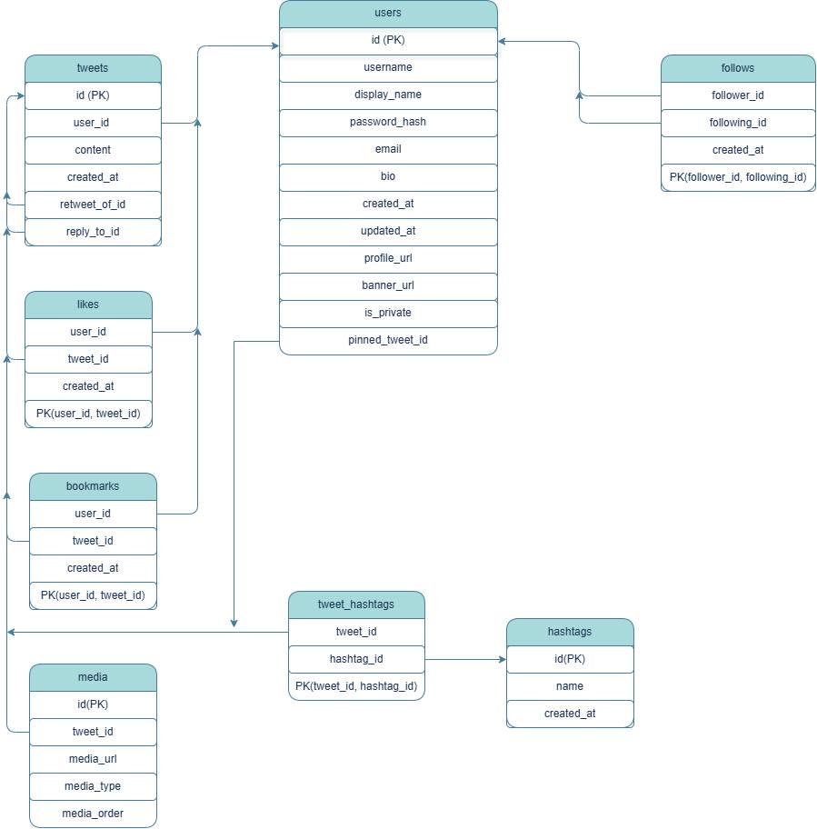

# X-Clone Project Report

## 1. System Architecture

### Overview

The project is a simplified implementation of the X (formerly Twitter) social media platform developed using Java. The application follows a **Client-Server Architecture**, where the client is responsible for user interaction and the server handles business logic and database operations.

The project is divided into three main modules:

- **Client**
- **Server**
- **Shared**

Each module has a specific responsibility, making the project easier to maintain and extend.

---

### Client

The client is implemented using **JavaFX** and follows the **Model-View-Controller (MVC)** architectural pattern.

Its responsibilities include:

- Displaying graphical user interfaces
- Receiving user input
- Sending requests to the server
- Displaying server responses
- Managing page navigation
- Managing user session information

Important components include:

- Controllers
- FXML Views
- Navigation Manager
- Session Manager
- Client Network Handler

---

### Server

The server contains the application's business logic.

Its responsibilities include:

- Processing client requests
- Authentication
- Managing users
- Managing tweets
- Managing follow relationships
- Managing media
- Communicating with the database
- Returning appropriate responses

Main server modules include:

- Client Handler
- DAO Layer
- Database Connection Manager

---

### Shared Module

The Shared module is used by both the client and the server.

It contains:

- DTO classes
- Request classes
- Response classes
- Enums
- Shared Models

Using a shared module avoids code duplication and guarantees that both client and server use the same data structures.

---

## Communication Flow

The communication process follows these steps:

1. User performs an action in the JavaFX interface.
2. The corresponding Controller creates a Request object.
3. The request is serialized and sent to the server.
4. The server receives and analyzes the RequestType.
5. Appropriate DAO classes interact with the PostgreSQL database.
6. The server creates a Response object.
7. The response is serialized and sent back.
8. The client updates the UI accordingly.

```
+-------------+        Request         +-------------+
|   Client    | ---------------------> |   Server    |
| (JavaFX UI) |                        | Business    |
+-------------+                        +-------------+
       ^                                       |
       |                                       |
       |             Response                  |
       +---------------------------------------+
                        |
                        v
              +----------------------+
              |  PostgreSql database |
              +----------------------+
```

---


### MVC (Model-View-Controller)

Used inside the client application.

- **Model:** Shared Models
- **View:** FXML files
- **Controller:** JavaFX Controllers

This separation keeps the UI independent of application logic.

---


## Major Modules

### Authentication Module

Responsible for:

- Signup
- Login
- Password verification
- Session management

Passwords are stored securely using **BCrypt hashing**.

---

### User Module

Handles:

- User profile
    - banner
    - avatar
    - name
    - username
    - bio
    - follower counts
    - following counts
    - tweets
    - replies
    - likes

- Profile editing
- Follow
- User search

---

### Follow Module

Responsible for:

- Follow
- Unfollow
- Followers list
- Following list
- Follow status checking

---

### Tweet Module

Responsible for:

- Creating tweets
- Displaying tweets
- Loading user tweets
- Sorting tweet information
- Edit tweets
- Delete tweets
- Pin tweets

---

### Feed Module

Displays tweets created by users that the current user follows.

The feed is generated on the server side by retrieving tweets from followed users and sending them to the client.

---

# 2. Database Design

## Overview

The project uses **PostgreSQL** as its relational database.

Database access is implemented using **JDBC**.

Each major entity is stored in its own table, and relationships are maintained using foreign keys.

---

## Main Entities

### Users

Stores user information.

Important attributes:

- id
- username
- display_name
- email
- password_hash
- bio
- profile_image
- banner_image
- created_at

---

### Tweets

Stores all user tweets.

Important attributes:

- id
- user_id
- content
- created_at
- retweet_of_id
- reply_to_id


---

### Follows

Represents follow relationships.

Attributes:

- follower_id
- following_id


---

## Entity Relationship Diagram

<p align="center">
  
</p>

# 3. Object-Oriented Design

## Overview

The project heavily relies on object-oriented programming principles.

Each class has a clear responsibility and interacts with other classes through well-defined interfaces.

---

## Important Classes

### User

Represents a user account.

Responsibilities:

- Store user information
- Transfer user data between layers

---

### Tweet

Represents a tweet.

Responsibilities:

- Hold tweet information (content, author, creation time, image, etc)
- Transfer tweet data

---

### UserDao

Responsibilities:

- Save user information.
- Find users by username or ID.
- Update user profile information.
- Authenticate users during login.

---

### TweetDao

Responsibilities:

- Create new tweets.
- Retrieve tweets from the database.
- Delete tweets.

---

### FollowDao

Responsibilities:

- Follow and unfollow users.
- Check whether a user follows another user.
- Get followers and following lists.
- Get the followers and following counts.
---

### ProfileController

Responsibilities:

- Display profile information
- Handle follow/unfollow actions
- Load user data
- Load tweets,likes and replies

---

### FollowListController

Responsibilities:

- Display followers list
- Display following list
- Navigate to user profiles


---

### Navigation

Handles page transitions and passes data between different scenes.

---

### Session

Stores information about the currently logged-in user.


---

## Object-Oriented programming

### Encapsulation

Each class hides its internal implementation and exposes only required methods.

---

### Abstraction

DAO classes abstract database operations from the rest of the application.

---

### Composition

Controllers use DAO classes rather than implementing database logic directly.

---

### Separation of Concerns

Responsibilities are divided among:

- UI
- Business Logic
- Database
- Networking

This improves readability and maintainability.

---
# 4.AI Usage

during the development of this project we used ChatGPT(GPT-5.5) and DeepSeek as a supporting tool.

AI assistance was used in the following areas:

- Assisting with debugging video playback issues.
- Providing suggestions for implementing media preview.
- Reviewing the implementation of hashtag-to-tweet relationships.
- Suggesting approaches for detecting, highlighting, and making hashtags clickable.
- Assisting with preserving page state during navigation.
- Providing styling suggestions for the `theme.css` file.
- Assisting with implementing the back button for the profile and reply pages.
- Suggesting solutions for automatically resizing the compose text area.
- Reviewing the implementation of the follow/unfollow feature.
- Assisting with debugging follower/following lists and counters.
- Reviewing DAO class implementations and database queries.
- Explaining client-server communication using DTOs.
- Assisting with debugging login and BCrypt password verification.
- Providing guidance for resolving Git merge conflicts.
- Assisting with writing and improving the project documentation.


